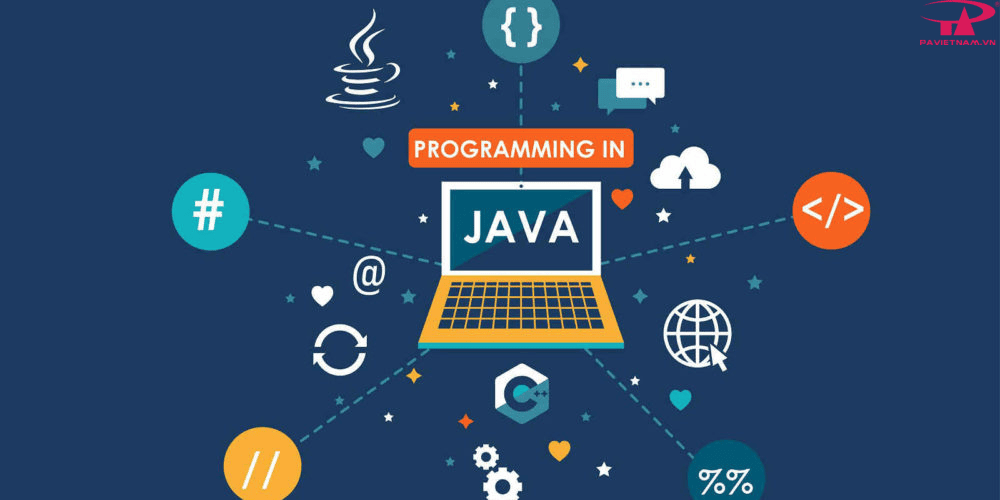
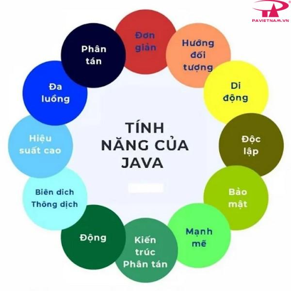
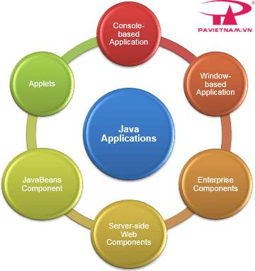
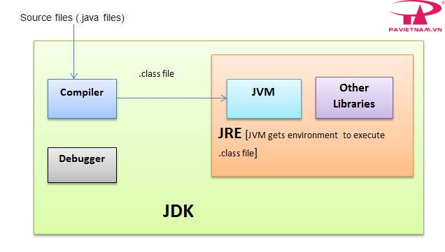
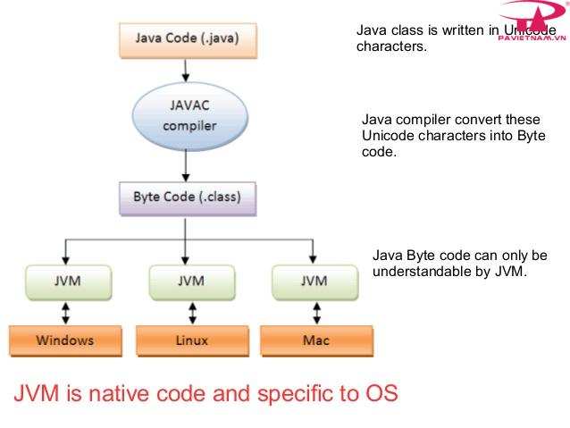
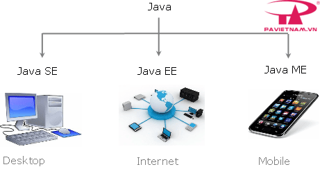
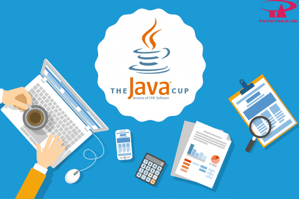
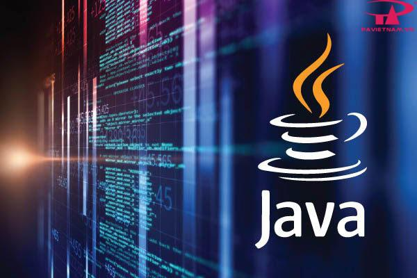

## Java là gì?

Java được biết đến là ngôn ngữ lập trình bậc cao, hướng đối tượng và giúp bảo mật mạnh mẽ, và còn được định nghĩa là một Platform. Java được phát triển bởi Sun Microsystems, do James Gosling khởi xướng và ra mắt năm 1995. Java hoạt động trên rất nhiều nền tảng như Windows, Mac và các phiên bản khác nhau của UNIX.

Hiểu rõ hơn, Java là gì? Chính là ngôn ngữ lập trình có mục đích, hướng đối tượng được phát triển cho môi trường phân tán và phát triển phần mềm. Ngôn ngữ này độc lập với nền tảng, không có giới hạn đối với bất kỳ phần cứng hay hệ điều hành cụ thể nào. Nó cung cấp cho người dùng cơ sở để có thể “viết một lần, chạy ở mọi nơi”.

## Một số tính năng của Java
 
Không chỉ biết về khái niệm Java là gì? Tính năng của lập trình cũng cần được nắm rõ, bao gồm:

* Hướng đối tượng: Trong Java, tất cả đều là một Object. Java có thể mở rộng và bảo trì dễ dàng bởi nó được xây dựng dựa trên mô hình Object.
* Nền tảng độc lập: Khi được biên dịch, Java không được biên dịch thành ngôn ngữ máy trên nền tảng cụ thể mà thay vào mã byte – một nền tảng độc lập. Mã byte này được thông dịch từ máy ảo (JVM) trên một nền tảng nào đó mà nó đang chạy.
* Đơn giản: Java được thiết kế đơn giản, dễ học. Chỉ hiểu khái niệm cơ bản về OOP Java, để trở thành master về java rất dễ.
* Bảo mật: Tính năng an toàn của Java cho phép phát triển các hệ thống không virus, không giả mạo, việc xác thực dựa trên mã hoá khóa công khai.
* Kiến trúc – trung lập: Trình biên dịch của Java tạo ra các định dạng tệp đối tượng kiến trúc trung lập, khiến mã biên dịch được thực thi trên nhiều bộ vi xử thông qua hệ điều hành Java.
* Portable: Một loại kiến trúc trung lập, phụ thuộc vào việc thực hiện, là những đặc điểm chính khi nói về Portable của Java. Các trình biên dịch tại Java được viết bằng ANSI C với ranh giới Portable gọn gàng, gọi là Subset POSIX, bạn có thể mang Byte Code của Java lên bất cứ một nền tảng nào.
* Mạnh mẽ: Java luôn nỗ lực loại trừ các tình huống dễ bị lỗi thông qua việc kiểm tra lỗi tại thời điểm biên dịch và kiểm tra lỗi tại runtime.
* Đa luồng: Giúp tạo ra các chương trình thực hiện cùng lúc nhiều tác vụ, cho phép các nhà phát triển xây dựng ứng dụng tương tác chạy trơn tru hơn.
* Thông dịch: Các mã byte Java được dịch trực tiếp tới các máy tính gốc và không được lưu trữ ở bất cứ đâu.
* Hiệu năng cao: Khi sử dụng trình biên dịch Just-In-Time, Java cho phép thực hiện hiệu năng cao.
* Phân tán: Java được sử dụng thiết kế cho môi trường phân tán của Internet.
* Năng động: Java năng động hơn C hoặc C++ do được thiết kế với mục đích thích ứng môi trường đang phát triển. Các chương trình Java sở hữu lượng lớn thông tin tại runtime có thể được sử dụng để xác minh hay giải quyết các truy cập vào các đối tượng tại runtime.

## Các loại ứng dụng được phát triển sử dụng Java

Được biết Java rất phổ biến và đã thống trị lĩnh vực này từ đầu những năm 2000, đến nay Java đã được sử dụng trong đa dạng các lĩnh vực khác nhau. Cụ thể:

* Desktop App như media player, acrobat reader, antivirus,…
* Web App như javatpoint.com, irctc.co.in,…
* Enterprise App như một vài ứng dụng về xử lý các nghiệp vụ ngân hàng,…
* Thiết bị Mobile như các ứng dụng IOS hay Android.
* Hệ thống nhúng.
* Smart Card.
* Robot.
* Game App.

## Kiến trúc và môi trường của Java

Nhắc đến kiến trúc và môi trường của Java, chúng ta sẽ nói đến 3 thành phần chính bao gồm: Máy ảo Java (JVM), môi trường thời gian chạy Java (JRE) và bộ phát triển Java (JDK).

### Máy ảo Java (JVM)

JVM cung cấp môi trường thời gian chạy trong đó bytecode thực thi. Máy ảo Java JVM thực hiện các nhiệm vụ sau:

* Tải mã.
* Xác minh mã.
* Thực thi mã.
* Tạo môi trường thời gian chạy.

### Môi trường thời gian chạy Java – JRE

JRE là tập hợp công cụ cho phép phát triển các ứng dụng và cung cấp môi trường thời gian chạy nhằm chạy các chương trình Java. JVM là một phần của JRE và chính JRE cũng phụ thuộc vào nền tảng. Đồng thời JRE còn hỗ trợ thực thi những chương trình Java, bao gồm JVM, bộ công cụ giao diện người dùng, Công nghệ triển khai hay plugin Java,…

### Bộ phát triển Java (JDK)

JDK là viết tắt của Java Development Kit, một bộ cung cấp môi trường để phát triển và thực thi các chương trình Java. JDK cũng chứa JRE chạy mã Java và chứa các tài nguyên khác như trình thông dịch/ trình tải, trình biên dịch, trình lưu trữ và trình tạo tài liệu.

Tất cả các thành phần này hợp lại giúp xây dựng các chương trình Java. Bộ phát triển Java bao gồm: Appletviewer (để xem các applet Java), Javac (trình biên dịch Java), Java (trình thông dịch Java), Javap (trình tháo gỡ Java), Javah (dành cho tệp tiêu đề C), Javadoc (để tạo tệp HTML) và Jdb (trình gỡ lỗi Java).

## Các phiên bản của Java

**Java Standard Edition (Java SE)**: là một nền tảng cơ bản cho phép phát triển giao diện điều khiển, các ứng dụng mạng và các ứng dụng dạng Win Form.

**Java Enterprise Edition (Java EE)**: được xây dựng trên nền tảng Java SE, giúp phát triển các ứng dụng web, các ứng dụng ở cấp doanh nghiệp, …

**Java Mobile Edition (Java ME)**: là một nền tảng cho phép phát triển các ứng dụng nhúng vào các thiết bị điện tử như mobile,…

Ưu, nhược điểm của Java

Trước những lợi ích mà Java mang lại chúng ta không thể phủ nhận, tuy nhiên, lập trình nào cũng sẽ có ưu điểm và nhược điểm nhất định. Vậy ưu, nhược điểm của Java là gì?

## Ưu, nhược điểm của Java
### Ưu điểm của Java

Để có thể được nhiều người đón nhận sử dụng và đánh giá tích cực, chắc chắn Java đã có những ưu điểm nhất định.

Cụ thể:

* Java là ngôn ngữ độc lập với nền tảng vì chúng ta có thể chạy mã Java ở bất kỳ máy nào mà không cần phần mềm đặc biệt.
* Là ngôn ngữ lập trình cấp cao dễ học và dễ hiểu.
* Là ngôn ngữ hướng đối tượng làm tăng khả năng phát triển mã dễ dàng và tăng hiệu quả.
* Là ngôn ngữ an toàn vì Java không sử dụng con trỏ. Quản lý bộ nhớ hiệu quả.
* Hỗ trợ đa luồng, người dùng có thể thực hiện cùng lúc nhiều chương trình.
* Có nhiều tính năng: tự động thu gom rác, không sử dụng con trỏ, xử lý ngoại lệ…

### Nhược điểm của Java

Bên cạnh những ưu điểm thì Java cũng tồn tại một vài nhược điểm. Vậy những nhược điểm của Java là gì?

* Là ngôn ngữ cấp cao nên phải xử lý các mức biên dịch và trừu tượng của một máy ảo.
* Hiệu suất kém.
* Có ít trình xây dựng GUI (Giao diện người dùng đồ họa) như Swing, SWT, JSF và JavaFX.
* Nếu viết những đoạn mã dài phức tạp dễ ảnh hưởng đến khả năng đọc của mã.

Mong rằng những thông tin trong bài viết giới thiệu sơ lược về ngôn ngữ lập trình Java trên sẽ giúp mọi người có thêm kiến thức cơ bản về ngôn ngữ lập trình Java và những ưu nhược điểm của nó.