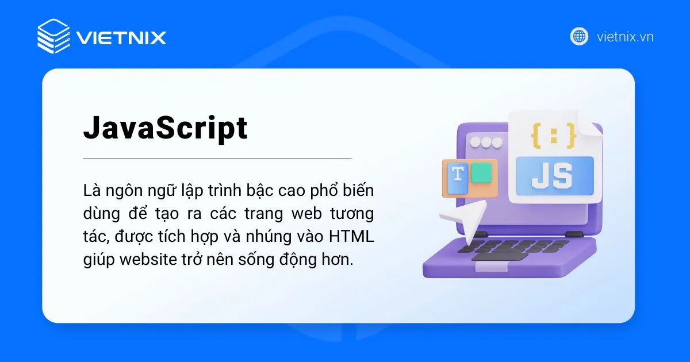
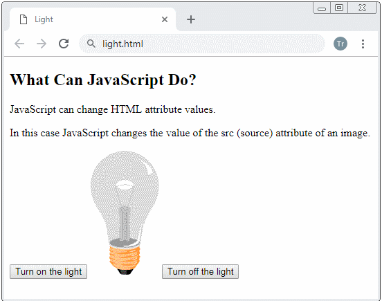

## JavaScript là gì?

JavaScript là một ngôn ngữ lập trình mạnh mẽ, được sử dụng rộng rãi để phát triển các ứng dụng web tương tác, cho phép bạn thêm các hiệu ứng động, xử lý dữ liệu người dùng, giao tiếp với máy chủ và tạo ra những trải nghiệm web mượt mà. Trong bài viết này, mình sẽ chia sẻ những kiến thức cơ bản về JavaScript để giúp bạn làm quen và có cái nhìn tổng quan nhất về ngôn ngữ này.

JavaScript viết tắt là JS là ngôn ngữ lập trình bậc cao phổ biến dùng để tạo ra các trang web tương tác, được tích hợp và nhúng vào HTML giúp website trở nên sống động hơn. JavaScript đóng vai trò như một phần của trang web, thực thi cho phép Client-Side Script từ phía người dùng cũng như phía máy chủ (Nodejs) tạo ra các trang web động.

JavaScript là một ngôn ngữ lập trình thông dịch với khả năng hướng đến đối tượng. Là một trong 3 ngôn ngữ chính trong lập trình web và có mối liên hệ lẫn nhau để xây dựng một website sống động, chuyên nghiệp, bạn có thể nhìn tổng quan như sau:

* HTML: Cung cấp cấu trúc cơ bản, hỗ trợ trong việc xây dựng layout, thêm nội dung dễ dàng trên website.
* CSS: Được sử dụng để kiểm soát và hỗ trợ việc định dạng thiết kế, bố cục, style, màu sắc,…
* JavaScript: Tạo nên những nội dung “động” trên website.

## Lịch sử phát triển của JavaScript

JavaScript được phát triển bởi Brendan Eich tại hãng truyền thông Netscape với tên đầu tiên là Mocha. Sau đó, đổi tên thành LiveScript và cuối cùng là JavaScript được sử dụng phổ biến tới thời điểm bây giờ. Phiên bản mới nhất của JavaScript là ECMAScript (là phiên bản chuẩn hóa của JavaScript). Với ECMAScript 2 phát hành năm 1998 và ECMAScript 3 được ra mắt năm 1999 và hoạt động mạnh mẽ trên mọi trình duyệt và các thiết bị khác nhau.

Năm 2016, JavaScript đạt kỷ lục đến 92% website sử dụng và được đánh giá từ một ngôn ngữ lập trình riêng trở thành công cụ quan trọng nhất trên các bộ công cụ lập trình web của các lập trình viên. Nếu bạn sử dụng internet khi truy cập vào các website, có thể nhìn thấy các hiệu ứng slide ảnh chuyển động, menu sổ xuống,…đều được tạo nên từ JavaScript.

## JavaScript dùng để làm gì?
### JavaScript thay đổi nội dung HTML

Một trong nhiều phương thức HTML JavaScript là `getElementById ()` . Ví dụ này sử dụng phương pháp để “tìm” một phần tử HTML (với id = “demo”) và thay đổi nội dung phần tử (InternalHTML) thành “Hello JavaScript”:

`document.getElementById("demo").innerHTML = "Hello JavaScript";`

### JavaScript thay đổi giá trị thuộc tính HTML

Trong ví dụ này, JavaScript thay đổi giá trị của thuộc tính src (source) của tag :

### JavaScript thay đổi kiểu HTML (CSS)

Thay đổi kiểu của một phần tử HTML là một biến thể của việc thay đổi thuộc tính HTML:
`document.getElementById("demo").style.fontSize = "35px";`
`or`
`document.getElementById('demo').style.fontSize = '35px';`

## Các framework JavaScript phổ biến nhất hiện nay

Framework JavaScript là bộ khung lập trình được xây dựng sẵn, hỗ trợ lập trình viên phát triển ứng dụng web hoặc mobile nhanh hơn nhờ khả năng tái sử dụng và mở rộng. Khác với thư viện (library) chỉ xử lý một số tác vụ nhất định, framework thường mang tính toàn diện hơn, giúp định hình kiến trúc và luồng xử lý cho cả ứng dụng. Dưới đây là danh sách những framework JavaScript được sử dụng rộng rãi hiện nay, phân chia theo từng nhóm ứng dụng:

**Front-end framework nổi bật**

* React.js
* Angular
* Vue.js
* Next.js

**Back-end framework phổ biến**

* Node.js
* Express.js
* Backbone.js
* Meteor.js

**Framework hỗ trợ phát triển ứng dụng Mobile**

* Electron.js
* React Native
* Cordova
* Expo

## Cách thức hoạt động của JavaScript trên trang web

JavaScript thường sẽ được nhúng trực tiếp vào một trang web hoặc được tham chiếu qua file .js riêng. JavaScript là ngôn ngữ từ phía client nên script sẽ được tải về máy client khi truy cập và được xử lý tại đó. Thay vì tải về máy server và sau khi xử lý xong mới phản hồi kết quả đến client.

Với hiện nay, thì các trình duyệt internet cũng có thể hỗ trợ bạn tắt/mở JavaScript. Lúc đó bạn có thể thấy được nếu một trang web không có JavaScript thì sẽ như thế nào? Từ đó bạn có thể hình dung dễ dàng hơn về cách JavaScript hoạt động.

## Ưu điểm và nhược điểm khi sử dụng JavaScript

Cùng mình tìm hiểu một số ưu điểm và nhược điểm khi sử dụng JavaScript là gì được chia sẻ cụ thể dưới đây nhé.

### Ưu điểm của JavaScript
JavaScript có các ưu điểm được xem là vượt trội so với các đối thủ khác trong các trường hợp thực tế như:

* Chương trình JavaScript rất dễ học.
* Lỗi JavaScript dễ phát hiện và sẽ giúp bạn sửa lỗi nhanh hơn.
* Các trình duyệt web có thể dịch nó bằng HTML mà không cần một compiler.
* JS hoạt động trên rất nhiều nền tảng và trình duyệt khác nhau.compiler
* Được đánh giá là ngôn ngữ lập trình nhẹ, nhanh so với các ngôn ngữ khác.
* JS có thể được gắn trên một số element hoặc các events của trang web.
* Khi website có sử dụng JS thì sẽ giúp cho trang web đó tương tác và tăng trải nghiệm người dùng khi truy cập.
* Bạn có thể tận dụng JavaScript để kiểm tra các input thay vì kiểm tra thủ công thông qua việc truy xuất database.
* Giao diện phong phú gồm các thành phần Drag and Drop, Slider để cung cấp một Rich Interface (Giao diện giàu tính năng).

### Nhược điểm của JavaScript

Mặt khác, ngoài những ưu điểm nhưng mọi ngôn ngữ lập trình khác đều có những nhược điểm riêng của nó như:

* Dễ bị khai thác từ những hacker và scammer.
* Có thể được dụng để thực thi mã độc trên máy tính của người dùng.
* JS code snippet lớn.
* Các thiết bị khác nhau có thể thực hiện JS khác nhau dẫn đến không đồng nhất.
* Vì tính bảo mật nên client-side JavaScript không cho phép đọc và ghi các file.
* JS không được hỗ trợ khi sử dụng trong kết nối mạng.
* JavaScript không có khả năng đa luồng hoặc đa xử lý.

## Lợi ích của JavaScript

JavaScript mang lại nhiều lợi ích quan trọng trong phát triển web:

* **Dễ dàng học và sử dụng**: Cú pháp của JavaScript được lấy cảm hứng từ ngôn ngữ lập trình Java, làm cho việc học và viết mã trở nên dễ dàng. Sự phổ biến của JavaScript trong việc viết mã phía máy khách và backend (với Node.js) giúp nó trở thành một ngôn ngữ linh hoạt và phổ biến.
* **Không phụ thuộc vào nền tảng**: JavaScript có thể chèn vào bất kỳ trang web nào và sử dụng với nhiều ngôn ngữ và khung phát triển web khác nhau. Sau khi viết, bạn có thể chạy mã JavaScript trên bất kỳ máy nào. Do đó, với JavaScript, việc phát triển ứng dụng có thể không phụ thuộc vào nền tảng.
* **Giảm tải máy chủ**: JavaScript có thể giảm tải máy chủ và tắc nghẽn mạng bằng cách chạy các phép toán logic và thực hiện nhiều công việc máy chủ trực tiếp trên máy khách. Ví dụ như trong quá trình điền một biểu mẫu đăng ký, JavaScript nhanh chóng kiểm tra xem số điện thoại di động có đúng 10 chữ số hay không. Việc này giúp tránh gửi yêu cầu đến máy chủ và làm tăng hiệu suất đăng ký.
* **Cải thiện giao diện người dùng**: JavaScript giúp tạo ra các trang web tinh tế, thuận tiện trong việc tìm kiếm và xử lý thông tin phức tạp. Sự linh hoạt của nó cho phép mở rộng chức năng và tương tác hiệu quả giữa người dùng và trang web.
* **Hỗ trợ đồng thời**: JavaScript có khả năng chạy song song nhiều tác vụ, giúp Node.js xử lý đồng thời nhiều yêu cầu và phản hồi máy chủ mà không làm suy giảm hiệu suất.

## Điểm khác biệt JavaScript với các ngôn ngữ lập trình

JavaScript được đóng vai trò như là ngôn ngữ chính trong lập trình web, ngoài ra các lập trình viên cũng cần sự kết hợp và áp dụng một số ngôn ngữ khác trong quá trình làm việc của mình như:

| Ngôn ngữ | Đặc điểm |
| :--- | :--- |
| **JavaScript** | JS giúp tăng tính tương tác trên website. Các Script chạy trên các trình duyệt của người dùng thay vì từ phía server và thường được sử dụng thư viện bên thứ 3 nên không cần bạn phải code lại từ đầu. |
| **HTML** | **H**ypertext **M**arkup **L**anguage, đây là ngôn ngữ cơ bản và phổ biến mà bạn cần phải biết khi bắt đầu với công việc lập trình web. Dùng để xây dựng bố cục (layout) chính cho nội dung toàn bộ website. |
| **CSS** | **C**ascading **S**tyle **S**heets giúp cho lập trình viên xác định style, tạo ra những ý tưởng, màu sắc, background riêng phù hợp với chủ đề của website. |
| **PHP** | Là ngôn ngữ từ phía server (JS chạy trên phía client). Thường dùng trong quá trình quản trị nội dung nền PHP như **WordPress** và cũng có thể được sử dụng với lập trình back-end. |

---
Trên đây là toàn bộ những kiến thức tổng quan về JavaScript là gì, cách thức hoạt động, ưu và nhược điểm cũng như cách viết chương trình JavaScript đơn giản mà mình muốn chia sẻ tới bạn. Nếu bạn đang tìm kiếm một ngôn ngữ lập trình đa năng để xây dựng các trang web và ứng dụng web tương tác, JavaScript chính là lựa chọn hàng đầu. Cảm ơn bạn đã theo dõi bài viết!