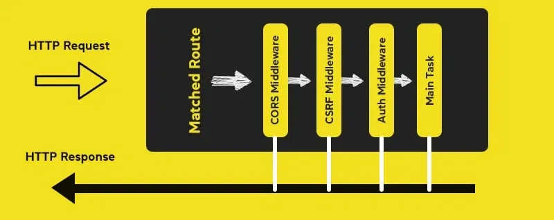
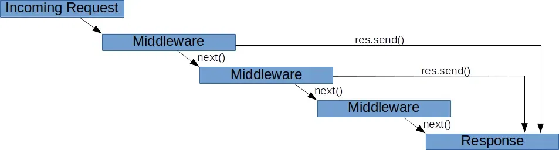
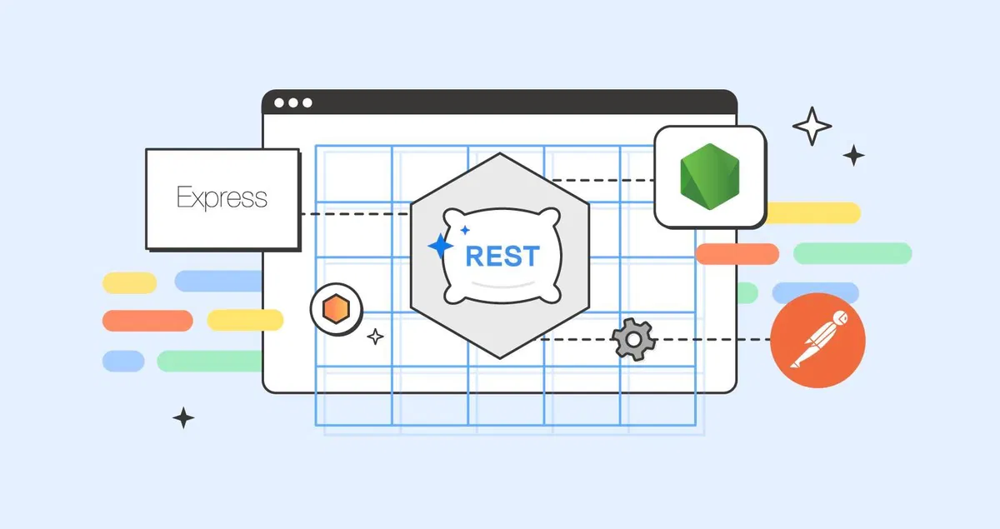

**Nếu bạn đang tìm hiểu về Node.js, chắc chắn bạn đã từng nghe đến Express.js—một framework cực kỳ phổ biến trong thế giới lập trình backend. Với sự gọn nhẹ, linh hoạt và dễ sử dụng, Express.js đã trở thành lựa chọn hàng đầu cho các lập trình viên muốn xây dựng ứng dụng web hoặc API một cách nhanh chóng và hiệu quả.**

**Trong bài viết này, chúng ta sẽ cùng khám phá Express.js là gì, lý do tại sao nó lại được cộng đồng lập trình yêu thích đến vậy, và những lợi ích mà framework này mang lại. Ngoài ra, bạn sẽ biết cách Express.js giúp đơn giản hóa quy trình phát triển ứng dụng Node.js ra sao. Cùng bắt đầu thôi nào!**

## Expressjs là gì?

**Express.js** là một framework đơn giản được xây dựng trên nền tảng Node.js, ra đời với mục đích làm cho việc phát triển các ứng dụng web và API trở nên đơn giản, hiệu quả và dễ bảo trì hơn. Bằng cách cung cấp các công cụ tiện lợi để xử lý yêu cầu HTTP, quản lý định tuyến (routing), và thêm các chức năng khác vào ứng dụng thông qua middleware.

Với Express.js, bạn có thể xây dựng các API RESTful dễ dàng hơn và quản lý dữ liệu hiệu quả mà không cần viết quá nhiều code phức tạp. Express.js giúp bạn tập trung vào logic ứng dụng thay vì xử lý chi tiết các yêu cầu HTTP.



Trong Node.js thuần, bạn phải tự viết code để quản lý các yêu cầu HTTP và xử lý dữ liệu. Ví dụ, nếu bạn muốn tạo một API để lấy danh sách công việc, thêm công việc mới, hoặc xóa công việc, code sẽ trông như thế này:

```go {fiename="javascript"}
const http = require('http');

let tasks = [
  { id: 1, task: 'Làm bài tập' },
  { id: 2, task: 'Dọn phòng' }
];

const server = http.createServer((req, res) => {
  if (req.url === '/tasks' && req.method === 'GET') {
    res.writeHead(200, { 'Content-Type': 'application/json' });
    res.end(JSON.stringify(tasks));
  } else if (req.url === '/tasks' && req.method === 'POST') {
    let body = '';
    req.on('data', chunk => {
      body += chunk.toString();
    });
    req.on('end', () => {
      const newTask = JSON.parse(body);
      tasks.push(newTask);
      res.writeHead(201, { 'Content-Type': 'application/json' });
      res.end(JSON.stringify(newTask));
    });
  } else {
    res.writeHead(404, { 'Content-Type': 'application/json' });
    res.end(JSON.stringify({ message: 'Không tìm thấy trang' }));
  }
});

server.listen(3000, () => {
  console.log('Server đang chạy tại http://localhost:3000');
});
```

Với Express.js, bạn chỉ cần khai báo các route đơn giản và sử dụng middleware để dễ dàng xử lý dữ liệu JSON:

```go {fiename="javascript"}
const express = require('express');
const app = express();
app.use(express.json()); // Middleware để xử lý JSON

let tasks = [
  { id: 1, task: 'Làm bài tập' },
  { id: 2, task: 'Dọn phòng' }
];

// Lấy danh sách công việc
app.get('/tasks', (req, res) => {
  res.json(tasks);
});

// Thêm công việc mới
app.post('/tasks', (req, res) => {
  const newTask = req.body;
  tasks.push(newTask);
  res.status(201).json(newTask);
});

// Xử lý các yêu cầu không hợp lệ
app.use((req, res) => {
  res.status(404).json({ message: 'Không tìm thấy trang' });
});

// Khởi chạy server
app.listen(3000, () => {
  console.log('Server đang chạy tại http://localhost:3000');
});
```

## Các tính năng chính của Expressjs
### Templating Engines

Templating engines cho phép bạn tạo các mẫu (templates) chứa các placeholder (chỗ trống) để sau đó có thể thay thế bằng dữ liệu thực tế khi trang được hiển thị. Điều này giúp tạo ra các trang HTML linh hoạt và dễ dàng hơn, đặc biệt là khi dữ liệu thay đổi thường xuyên.

Các templating engines phổ biến trong Express.js bao gồm:

* **EJS** (Embedded JavaScript): Cho phép nhúng JavaScript trực tiếp vào trong HTML.
* **Pug**: Cung cấp cú pháp ngắn gọn, dễ đọc hơn để tạo HTML.
* **Handlebars** và **Mustache**: Là các engines khác thường được sử dụng để quản lý views và tạo HTML.

Ví dụ: Bạn tạo một tệp EJS chứa các placeholder trong thư mục `views` (ví dụ: `index.ejs`):

```go {fiename="HTML"}
<html>
<head>
  <title>Trang chào mừng</title>
</head>
<body>
  <h1>Xin chào, <%= name %>!</h1>
  <p>Tuổi của bạn là: <%= age %></p>
</body>
</html>
});
```

Sau đó, bạn có thể sử dụng template này để hiển thị cho người dùng khi họ truy cập trang:

```go {fiename="javascript"}
app.get('/', (req, res) => {
  // Truyền dữ liệu vào template
  res.render('index', { name: 'John', age: 25 });
});

app.listen(3000, () => {
  console.log('Server đang chạy tại http://localhost:3000');
});
```
Khi người dùng truy cập vào trang chủ, dữ liệu thực tế (`name` và `age`) sẽ được thay thế vào template.

### Phục vụ các tệp tĩnh

Middleware `express.static()` giúp việc phục vụ các tệp tĩnh trong dự án trở nên đơn giản. Bạn chỉ cần chỉ định thư mục chứa các tệp tĩnh (như hình ảnh, CSS, JavaScript), và Express.js sẽ tự động xử lý việc cung cấp chúng cho người dùng khi họ yêu cầu.

Tệp tĩnh (static files) là những tệp không cần xử lý phức tạp từ máy chủ, mà chỉ được gửi trực tiếp đến người dùng, như hình ảnh, tệp CSS để tạo kiểu, hoặc tệp JavaScript để chạy trên trình duyệt.

```go {fiename="javascript"}
const express = require('express');
const app = express();

// Sử dụng middleware để phục vụ các tệp tĩnh trong thư mục 'public'
app.use(express.static('public'));

app.listen(3000, () => {
  console.log('Server đang chạy tại http://localhost:3000');
});
```

Lệnh `app.use(express.static('public'))` sẽ bảo Express.js tự động cung cấp các tệp tĩnh có trong thư mục public. Khi người dùng truy cập vào trang web, họ sẽ có thể thấy các tệp tĩnh từ thư mục này mà bạn không cần phải viết thêm code để xử lý từng yêu cầu.

### Định tuyến

**Routing** (Định tuyến) trong Express.js là cách bạn thiết lập các quy tắc để xử lý các yêu cầu HTTP từ người dùng đến đúng nơi trong ứng dụng của bạn. Mỗi URL sẽ được gán với một route (định tuyến), và mỗi route có thể xử lý các loại yêu cầu khác nhau như GET, POST, PUT, DELETE, v.v.

Giả sử bạn có một website đơn giản với ba trang:

* Trang chủ (`/`)
* Trang giới thiệu (`/about`)
* Trang liên hệ (`/contact`)

Bạn sẽ tạo các route tương ứng để khi người dùng truy cập vào các đường dẫn này, ứng dụng của bạn sẽ phản hồi phù hợp.

```go {fiename="javascript"}
const express = require('express');
const app = express();

// Định tuyến trang chủ
app.get('/', (req, res) => {
  res.send('Chào mừng bạn đến với trang chủ!');
});

// Định tuyến trang giới thiệu
app.get('/about', (req, res) => {
  res.send('Đây là trang giới thiệu về chúng tôi.');
});

// Định tuyến trang liên hệ
app.get('/contact', (req, res) => {
  res.send('Trang liên hệ với chúng tôi.');
});

// Khởi động máy chủ
app.listen(3000, () => {
  console.log('Server đang chạy tại http://localhost:3000');
});
```

### Middleware

**Middleware** là những hàm đặc biệt trong Express.js, được thực thi khi ứng dụng của bạn nhận yêu cầu từ người dùng và trước khi gửi phản hồi về cho họ. Middleware có thể thực hiện nhiều nhiệm vụ như:

* Ghi lại thông tin về yêu cầu.
* Xác thực người dùng.
* Xử lý dữ liệu.
* Trả về lỗi khi có vấn đề xảy ra.



Mỗi khi có một yêu cầu (ví dụ: truy cập một trang web), yêu cầu đó sẽ đi qua các **middleware** theo thứ tự bạn đã định nghĩa trong mã nguồn. Mỗi middleware có thể:

* Tiếp tục yêu cầu và chuyển cho middleware tiếp theo (dùng hàm `next()`).
* Kết thúc yêu cầu và gửi phản hồi ngay lập tức về cho người dùng (không cần chuyển tiếp nữa).

```go {fiename="javascript"}
const express = require('express');
const app = express();

// Middleware 1: Ghi lại URL của yêu cầu
app.use((req, res, next) => {
  console.log('Yêu cầu đến từ URL:', req.url);
  next(); // Chuyển tiếp đến middleware tiếp theo
});

// Middleware 2: Tiếp tục xử lý yêu cầu
app.use((req, res, next) => {
  console.log('Đang xử lý yêu cầu...');
  next(); // Tiếp tục chuyển đến phần xử lý chính
});

// Định tuyến trang chủ
app.get('/', (req, res) => {
  res.send('Chào mừng bạn đến với trang chủ!');
});

// Middleware xử lý lỗi
app.use((err, req, res, next) => {
  console.error('Có lỗi xảy ra:', err.message);
  res.status(500).send('Xin lỗi, đã có lỗi xảy ra!');
});

// Khởi động máy chủ
app.listen(3000, () => {
  console.log('Server chạy trên cổng 3000');
});
```

### Hỗ trợ xây dựng RESTful API

Express.js hỗ trợ xây dựng API tuân thủ các nguyên tắc của kiến trúc **REST** (Representational State Transfer) thông qua việc thiết lập các route tương ứng với từng yêu cầu.



Giả sử bạn muốn xây dựng một API quản lý danh sách sản phẩm. API này sẽ bao gồm các tính năng như:

* Xem danh sách tất cả sản phẩm.
* Xem thông tin chi tiết của một sản phẩm.
* Thêm một sản phẩm mới.
* Cập nhật thông tin sản phẩm.
* Xóa sản phẩm.

```go {fiename="javascript"}
const express = require('express');
const app = express();

app.use(express.json()); // Middleware để xử lý dữ liệu JSON

let products = [
  { id: 1, name: 'Điện thoại', price: 500 },
  { id: 2, name: 'Laptop', price: 1000 }
];

// 1. Lấy danh sách tất cả sản phẩm (GET request)
app.get('/products', (req, res) => {
  res.json(products);
});

// 2. Lấy thông tin chi tiết của một sản phẩm (GET request)
app.get('/products/:id', (req, res) => {
  const product = products.find(p => p.id === parseInt(req.params.id));
  if (!product) return res.status(404).send('Sản phẩm không tồn tại');
  res.json(product);
});

// 3. Thêm một sản phẩm mới (POST request)
app.post('/products', (req, res) => {
  const newProduct = {
    id: products.length + 1,
    name: req.body.name,
    price: req.body.price
  };
  products.push(newProduct);
  res.status(201).json(newProduct);
});

// 4. Cập nhật thông tin một sản phẩm (PUT request)
app.put('/products/:id', (req, res) => {
  const product = products.find(p => p.id === parseInt(req.params.id));
  if (!product) return res.status(404).send('Sản phẩm không tồn tại');

  product.name = req.body.name;
  product.price = req.body.price;
  res.json(product);
});

// 5. Xóa một sản phẩm (DELETE request)
app.delete('/products/:id', (req, res) => {
  const product = products.find(p => p.id === parseInt(req.params.id));
  if (!product) return res.status(404).send('Sản phẩm không tồn tại');

  const index = products.indexOf(product);
  products.splice(index, 1);
  res.json(product);
});

// Khởi động máy chủ
app.listen(3000, () => {
  console.log('Server đang chạy tại http://localhost:3000');
});
```

## Kết luận

Express.js là một công cụ không thể thiếu cho các lập trình viên backend, nhất là khi bạn muốn xây dựng các ứng dụng web hoặc API một cách nhanh chóng và hiệu quả. Express.js là một lựa chọn tuyệt vời cho những ai đang làm việc với Node.js vì nó cân bằng tốt giữa hiệu năng và sự dễ sử dụng.