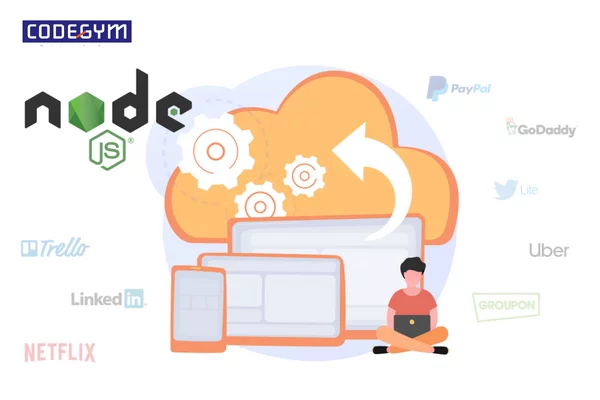
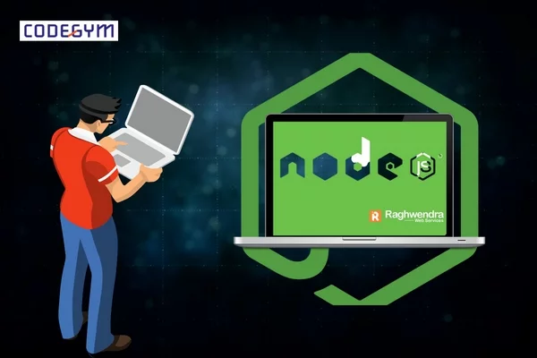
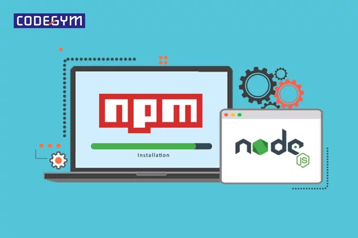
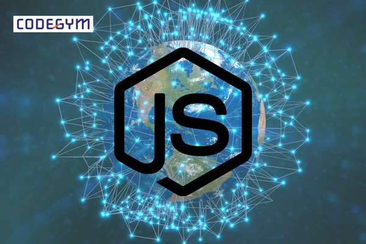

## NodeJS là gì?

NodeJS là một loại mã nguồn mở và khởi chạy trên môi trường V8 JavaScript Runtime – trình thông dịch JavaScript tốc độ cực nhanh trên trình duyệt Chrome. Từ khi ra đời, NodeJS hỗ trợ chương trình của các nhà phát triển web trở nên đơn giản và dễ dàng để mở rộng.

Ban đầu dự án phát triển NodeJS có tên là web.js. Khi ấy mục đích đơn thuần của nó chỉ để sử dụng như một ứng dụng web, thay cho Apache và một số server khác. Tuy nhiên, dự án web.js nhanh chóng phát triển và vượt qua khả năng của một webserver thông thường. Thậm chí nó còn có thể được coi như một nền tảng đa mục đích. Vì vậy, ngay sau đó dự án được từ đổi tên từ web.js thành Node.JS và được sử dụng cho đến ngày nay.

## Ưu và nhược điểm của NodeJS là gì?
### Ưu điểm

* IO hướng sự kiện của NodeJS xử lý được nhiều yêu cầu đồng thời.
* NodeJS đáp ứng được những yêu cầu độ chính xác cao về thời gian thực.
* NodeJS có tốc độ cực nhanh, đáp ứng được dữ liệu “khổng lồ” của khách truy trong thời gian ngắn.
* NodeJS phát triển dựa trên ngôn ngữ lập trình JavaScript và đây là ngôn ngữ lập trình rất dễ để học.
* Có thể chia sẻ cùng một đoạn mã với cả hai phía: máy chủ và máy khách.
* Npm và các module của NodeJS rất mạnh mẽ và vẫn đang tiếp tục phát triển.
* NodeJS có một cộng đồng hỗ trợ lớn mạnh, có nhiều mã có thể được chia sẻ qua githu.
* NodeJS tương thích với nhiều thiết bị, nhiều hệ điều hành khác nhau như: Window, Linux,…

### Nhược điểm

* Bạn không thể mở rộng NodeJS và vì thế mà bạn cũng không thể tận dụng lợi thế của nhiều lõi thường có sẵn trong phần cứng máy chủ ngày nay.
* Nếu bạn có nhiều lệnh gọi lại liền nhau, khi bạn sử dụng lệnh gọi lại sẽ kết thúc cùng lúc rất nhiều những lệnh gọi lại lồng vào nhau khác.
* Nếu bạn muốn học tốt NodeJS, bắt buộc bạn phải sử dụng tốt JavaScript trước đó.
* Với những tác vụ đòi hỏi nhiều CPU, bạn không nên sử dụng NodeJS.
* Nếu web hosting của bạn là hosting dùng chung, bạn sẽ gặp khó khăn trong việc tải lên một ứng dụng NodeJS.

## Những ứng dụng bạn nên viết bằng Node.JS

Bạn có thể sử dụng NodeJS để xây dựng nhiều loại ứng dụng khác nhau. Từ ứng dụng web, ứng dụng trò chuyện,… nó đều có thể thực hiện tốt. Tuy nhiên, để có thể tận dụng được tối đa điểm mạnh của mình, NodeJS thường được sử dụng để xây dựng chương trình mạng cho máy chủ web (tương tự như PHP, Java hoặc ASP.NET). 

Một số ứng dụng phổ biến được xây dựng bằng NodeJS như: 

* Hệ thống thanh toán trực tuyến: Paypal,…
* Nền tảng xã hội: LinkedIn, Storify,…
* Dịch vụ streaming: Netflix,…
* Nền tảng E-Commerce: eBay,…
* Nền tảng xuất bản trực tuyến: Medium, Wall Street Journal,…
* E-learning platform:  Quizlet, Trello,…

## Lý do bạn nên sử dụng NodeJS là gì?

Hiện nay Node.JS ngày càng phổ biến và được yêu thích bởi các lập trình viên. Vậy lý do gì mà khiến nó được lòng các lập trình viên như vậy? Cùng tìm hiểu dưới đây nhé.

* Tốc độ của NodeJS cực nhanh: Các thư viện của NodeJS có khả năng thực thi code rất nhanh do được xây dựng trên engine JavaScript V8 của Google Chrome. 
* NPM: Với hơn 50,000 package khác nhau, các lập trình viên có nhiều lựa chọn cho việc xây dựng cho ứng dụng của mình.
* Mọi API của NodeJS có tính non-blocking(tức là không đồng bộ), do đó nó có chứa một server dựa trên Node. Vì thế mà JS không cần đợi API trả dữ liệu về.
* Không có buffering: NodeJS tiết kiệm khá nhiều thời gian xử lý những file nặng, ví dụ như những file video hoặc âm thanh.

## Hai framework được sử dụng phổ biến của NodeJS là gì?
### Express
Framework Express được yêu thích sử dụng bởi 73% các nhà phát triển NodeJS. Một con số khá ấn tượng phải không? Vì thế, express luôn được ưu tiên sử dụng với các lập trình viên mới. Express là một NodeJS framework động. Nó cung cấp sự linh hoạt và sự tự do cho các nhà phát triển trong việc tùy chỉnh giao diện của ứng dụng.

Lợi ích của Express:

* Express cung cấp các plugin và các tiện ích khác nhau.
* Tích hợp các loại dữ liệu liền mạch
* Cơ chế định tuyến quen thuộc, dựa trên URL sử dụng HTTP không gây quá nhiều khó khăn cho lập trình viên.
* Mạnh mẽ và có thể tùy chỉnh
* Có thể tạo các ứng dụng tập trung bởi nó đi kèm MVC

Express phù hợp cho tất cả các loại phát triển web và ứng dụng di động ngay từ cấp nhỏ đến cấp doanh nghiệp. Trong NodeJS có tích hợp sẵn sẵn để tạo API. Vì thế mà bạn có thể tiết kiệm khá nhiều thời gian trong việc phát triển ứng dụng web với Express. 

### SocketIO

Socket.io là một full-stack framework có thể được sử dụng bởi nhiều ngôn ngữ lập trình. Nó cung cấp một API có thể hoạt động kết hợp với hầu hết mọi dịch vụ khác. Các nhà phát triển thực sự bị ấn tượng với framework này bởi tốc độ phát triển vượt trội và độ tin cậy của nó.

Lợi ích của việc sử dụng Socket.io:

* Phân tích thời gian thực
* Phát trực tuyến nhị phân và quản lý ổ cắm dễ dàng
* Tự động phát hiện và sửa lỗi

## Hướng dẫn cài đặt và khai báo cho NodeJS

Cài đặt NodeJS cũng khá đơn giản, bạn hãy làm theo các bước hướng dẫn sau đây của CodeGym Hà Nội:

### Cài đặt NodeJS

* Bước 1: Truy cập website chính thức của NodeJS, sau đó download NodeJS version mới nhất.
* Bước 2: Nhập lệnh node -v vào cmd để kiểm tra trạng thái cài đặt.
* Bước 3: Tạo một Folder mới để chứa các nội dung cho dự án. Trong đó,  tạo một file và đặt tên là Project.js rồi nhập nội dung cần viết. Ví dụ:

`Console.log('Hell World');`

Muốn chạy chương trình, truy cập vào folder vừa tạo, giữ Shift rồi click chuột phải vào folder và chọn Open Powershell window here. Sau khi cửa sổ command line hiện lên thì gõ lệnh node Project.js. Bây giờ command line sẽ hiện lên để người dùng khai báo biến và hằng trong NodeJS.

### Khai báo biến và hằng trong NodeJS

Khai báo biến: Có hai cách để khai báo biến trong NodeJS:

**Cách 1: Khai báo biến dùng từ khoá var.**

`var variable_name = value;`

**Cách 2: Khai báo biến không dùng từ khoá var.**

`variable_name = value;`

## Lời kết

Thông qua bài viết vừa rồi, hi vọng bạn đã nắm được NodeJS là gì và cách cài đặt cũng như khai báo của chúng. Nếu bạn còn thắc mắc gì khác, hãy liên hệ ngay fanpage CodeGym Hà Nội để được tư vấn nhé. 

Chúc bạn thành công!