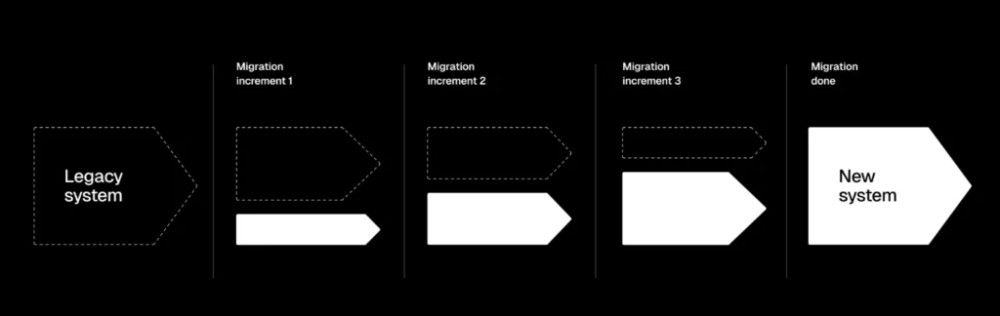

## Giới thiệu về jQuery và So sánh React

Gần đây, tôi quyết định so sánh jQuery với React. Điều quan trọng cần làm rõ là chúng phục vụ các mục đích khác nhau , nên việc so sánh trực tiếp có thể gây hiểu lầm. Vì vậy, thay vào đó, tôi sẽ tìm hiểu cách mỗi công nghệ phù hợp với các nhu cầu phát triển web riêng biệt. Trong một số trường hợp, hai thư viện JavaScript phổ biến này hoạt động cùng nhau như một nhóm thực sự .

Cả React và jQuery đều sử dụng Javascript và đóng vai trò then chốt trong việc định hình thế giới phát triển web. Theo Khảo sát StackOverflow, các thư viện này luôn được xếp hạng trong số các công nghệ và framework web phổ biến nhất. Tuy nhiên, quỹ đạo phát triển của chúng lại khác nhau. jQuery đã tồn tại gần hai mươi năm, nhưng mức độ quan tâm đã giảm đáng kể, từ 34% xuống 15% chỉ sau hai năm (2021 so với 2023). Điều thú vị là vào năm 2024, nó lại tăng trưởng trở lại và đạt 21%.

Ngược lại, React vẫn phổ biến kể từ năm 2021 và tiếp tục thu hút sự quan tâm đáng kể từ các nhà phát triển.

Hãy cùng tìm hiểu sâu hơn về từng công nghệ, hiểu rõ các chức năng cốt lõi và thế mạnh của chúng. Tìm hiểu cách chúng có thể được sử dụng hiệu quả trong các tình huống phát triển khác nhau.

## Hiểu về jQuery

jQuery là một thư viện được John Resig phát hành năm 2006. Nó được thiết kế để đơn giản hóa sự phức tạp của các tác vụ JavaScript , đặc biệt là trong thao tác DOM và xử lý sự kiện. Mục đích chính của nó là giúp các nhà phát triển web dễ dàng viết JavaScript hoạt động trên nhiều trình duyệt khác nhau. Nó giúp giảm bớt những điểm khó chịu do sự không nhất quán giữa các trình duyệt.

### Chức năng chính của jQuery

**Thao tác DOM**: jQuery cung cấp một API trực quan và dễ hiểu để chọn và thao tác các phần tử DOM. Cú pháp bộ chọn $ cho phép các nhà phát triển JavaScript nhanh chóng tìm và thay đổi các phần tử trên trang web. Đây là một trong những tính năng nổi bật nhất của jQuery.

**Xử lý sự kiện**: Với jQuery, việc xử lý các sự kiện như nhấp chuột, nhấn phím và di chuyển chuột trở nên đơn giản. jQuery tóm tắt những khác biệt trong cách trình duyệt xử lý sự kiện, cung cấp một phương thức thống nhất để quản lý tương tác của người dùng.

**AJAX**: Các phương thức AJAX của jQuery hỗ trợ các yêu cầu HTTP không đồng bộ, cho phép các nhà phát triển tải dữ liệu ở chế độ nền mà không cần làm mới toàn bộ trang. 

**Khả năng tương thích đa trình duyệt**: Một trong những điểm mạnh cốt lõi của jQuery là khả năng xử lý sự không nhất quán giữa các trình duyệt. Nó làm mịn sự khác biệt giữa các trình duyệt, đảm bảo cùng một mã hoạt động nhất quán trên nhiều môi trường khác nhau.

**Hoạt ảnh**: jQuery cung cấp một bộ phương thức để tạo hoạt ảnh, giúp dễ dàng thêm các hiệu ứng hình ảnh như mờ dần, trượt và hoạt ảnh tùy chỉnh vào trang web. Tính năng này nâng cao trải nghiệm người dùng bằng cách thêm các hiệu ứng chuyển tiếp nội dung động.

### Các trường hợp sử dụng tốt nhất cho jQuery

**Trang web đơn giản**: Thư viện jQuery lý tưởng cho các trang web đơn giản, yêu cầu tương tác cơ bản mà không cần đến một framework JavaScript đầy đủ. Tính chất nhẹ nhàng của nó khiến nó phù hợp với những tình huống này.

**Thêm tính tương tác vào trang tĩnh**: Đối với các trang tĩnh cần một chút tương tác, jQuery là một công cụ hoàn hảo. Nó có thể thêm các thành phần động như thanh trượt hình ảnh, xác thực biểu mẫu và menu tương tác với mã code tối thiểu.

**Tạo nguyên mẫu nhanh**: Khi tốc độ là yếu tố quan trọng và mục tiêu là tạo nguyên mẫu nhanh chóng cho một khái niệm, jQuery cung cấp các công cụ cần thiết để nhanh chóng xây dựng các mô hình chức năng. Tính dễ sử dụng và tài liệu hướng dẫn phong phú khiến jQuery trở thành lựa chọn tuyệt vời cho việc tạo nguyên mẫu.

**Xử lý biểu mẫu phong phú**: jQuery được sử dụng để tạo các biểu mẫu động, tương tác với xác thực thời gian thực, các trường điều kiện và gửi dữ liệu AJAX. Ví dụ: một biểu mẫu đăng ký hiển thị động các trường bổ sung dựa trên dữ liệu người dùng nhập có thể được triển khai nhanh chóng với jQuery.

**Sự đơn giản và các tính năng mạnh mẽ của jQuery đã khiến nó trở thành một công cụ chủ chốt trong phát triển web trong nhiều năm**. Và cho đến ngày nay, bất chấp sự xuất hiện của các framework hiện đại, jQuery vẫn giữ được giá trị, đặc biệt là trong những tình huống cần đến sức mạnh của nó nhất.

## Hiểu về React js

React là một thư viện dùng để xây dựng giao diện người dùng, được Facebook phát triển và phát hành vào năm 2013. Mục đích cốt lõi của nó là cung cấp một phương pháp khai báo và hiệu quả để xây dựng các thành phần UI có thể tái sử dụng, giúp quản lý trạng thái và hiển thị các ứng dụng phức tạp dễ dàng hơn.

### Các tính năng chính của React js

**Kiến trúc dựa trên thành phần**: React khuyến khích xây dựng giao diện người dùng bằng các thành phần có thể tái sử dụng. Mỗi thành phần đại diện cho một phần độc lập của giao diện người dùng (UI), giúp quản lý và bảo trì các ứng dụng lớn dễ dàng hơn. Các thành phần có thể được lồng ghép, quản lý và xử lý độc lập, thúc đẩy phương pháp phát triển theo mô-đun.

**DOM ảo**: Mô hình Đối tượng Tài liệu Ảo là một bản sao nhẹ của DOM thực tế. React sử dụng DOM ảo để tối ưu hóa việc cập nhật và hiển thị. Khi trạng thái của một thành phần thay đổi, React sẽ cập nhật DOM ảo trước, so sánh nó với DOM thực và chỉ thực hiện những thay đổi cần thiết. Quá trình này, được gọi là đối chiếu, giúp các ứng dụng React nhanh chóng và hiệu quả hơn.

**Quản lý trạng thái**: Quản lý trạng thái rất quan trọng trong thư viện React. Mỗi thành phần có thể có trạng thái riêng, quyết định cách hiển thị và hoạt động của nó. Quản lý trạng thái của React, kết hợp với các thư viện như Redux hoặc Context API, cho phép xử lý logic trạng thái phức tạp và chia sẻ trạng thái giữa các thành phần một cách liền mạch.

**Luồng dữ liệu đơn hướng**: React đi kèm với luồng dữ liệu đơn hướng, nghĩa là dữ liệu chảy theo một hướng từ thành phần cha đến thành phần con. Điều này giúp việc gỡ lỗi và hiểu cách dữ liệu được truyền qua ứng dụng dễ dàng hơn, dẫn đến mã dễ dự đoán và bảo trì hơn.

**JSX**: React sử dụng JSX, một phần mở rộng cú pháp cho phép các nhà phát triển viết mã giống HTML trong JavaScript. Điều này giúp dễ dàng hình dung cấu trúc giao diện người dùng ngay trong mã JavaScript, cải thiện khả năng đọc và năng suất của nhà phát triển.

### Các trường hợp sử dụng tốt nhất cho React

**Ứng dụng Nội dung Động**: Đối với các ứng dụng cần cập nhật nội dung thường xuyên dựa trên tương tác của người dùng hoặc dữ liệu thời gian thực, khả năng kết xuất và quản lý trạng thái hiệu quả của React là một điểm cộng. Điều này làm cho nó trở nên hoàn hảo cho các ứng dụng trò chuyện trực tiếp, bảng điều khiển dữ liệu thời gian thực và ứng dụng nguồn cấp tin tức.

**Giao diện người dùng phức tạp**: React phù hợp hơn với việc xây dựng các ứng dụng có giao diện người dùng phức tạp, nơi nhiều yếu tố tương tác cần được quản lý hiệu quả. Điều này bao gồm các nền tảng thương mại điện tử với các tính năng như vòng quay sản phẩm, tùy chọn lọc và đánh giá của người dùng, vốn yêu cầu giao diện người dùng động và tương tác.

**Ứng dụng Doanh nghiệp**: Nhiều nhà phát triển ưa chuộng React để xây dựng các ứng dụng doanh nghiệp quy mô lớn đòi hỏi cơ sở mã mạnh mẽ và dễ bảo trì. Ví dụ bao gồm hệ thống quản lý quan hệ khách hàng (CRM), hệ thống hoạch định nguồn lực doanh nghiệp (ERP) và bảng điều khiển nội bộ, nơi mà phương pháp tiếp cận theo mô-đun và dễ bảo trì là rất quan trọng.

**PWA**: React mang đến cơ hội tạo ra các ứng dụng web tiến bộ (progressive web app) mang lại trải nghiệm tương tự ứng dụng gốc trên web, thường được kết hợp với service worker. React lý tưởng cho các ứng dụng ưu tiên ngoại tuyến và ứng dụng web đáp ứng hoạt động trên nhiều thiết bị và điều kiện mạng khác nhau.

**Các dự án được xây dựng với Next.js**: Next.js, được xây dựng trên React, nâng cao khả năng render phía máy chủ và tạo trang web tĩnh. Điều này làm cho nó hoàn hảo cho các trang web thân thiện với SEO, blog có nhiều nội dung và các trang web thương mại điện tử có nội dung động cần được lập chỉ mục bởi các công cụ tìm kiếm.

## Sự khác biệt chính giữa jQuery và React

Sự khác biệt chính giữa jQuery và React nằm ở mục đích cốt lõi, cách tiếp cận và trọng tâm của chúng.

### Mục đích của jQuery so với React

jQuery đơn giản hóa JavaScript để thao tác DOM, xử lý sự kiện và tương tác AJAX trong khi React cung cấp một khuôn khổ để xây dựng giao diện người dùng động và tương tác với kiến ​​trúc dựa trên thành phần.

### Tiếp cận phát triển web với jQuery và React

jQuery là một thư viện JavaScript giàu tính năng giúp làm việc với DOM và xử lý sự kiện trên nhiều trình duyệt khác nhau dễ dàng hơn. React trừu tượng hóa giao diện người dùng thành các thành phần có thể tái sử dụng và sử dụng DOM ảo để cập nhật và hiển thị giao diện một cách hiệu quả.

### Sự khác biệt giữa React và jQuery trong tiêu điểm

jQuery tập trung vào việc thao tác DOM trực tiếp và tăng cường khả năng tương tác với thiết lập tối thiểu trong khi React tập trung vào việc xây dựng giao diện người dùng phức tạp, theo trạng thái với phong cách lập trình khai báo, giúp quản lý trạng thái và hành vi của ứng dụng dễ dàng hơn.

## Sử dụng bổ sung trong các dự án: Các tình huống thực tế khi kết hợp jQuery và React có ý nghĩa

Mặc dù, hoặc nhờ vào mục đích khác nhau, React và jQuery được sử dụng như những thư viện bổ sung cho nhau trong các dự án khác nhau. Dưới đây là một số ví dụ:

* Di chuyển gia tăng:
    * Tình huống: Một ứng dụng web cũ sử dụng jQuery cần có các tính năng mới.
    * Phương pháp tiếp cận: Sử dụng React để phát triển các tính năng mới, phức tạp trong khi vẫn giữ nguyên cơ sở mã jQuery hiện có để tương tác đơn giản hơn. Điều này cho phép chuyển đổi dần dần sang React mà không làm gián đoạn toàn bộ ứng dụng.

* Tính tương tác cao hơn trên các trang tĩnh:
    * Kịch bản: Một trang web tĩnh cần có tính tương tác cao hơn, chẳng hạn như hộp thoại mô-đun và xác thực biểu mẫu.
    * Phương pháp tiếp cận: Triển khai jQuery cho các tác vụ đơn giản như xác thực biểu mẫu và hoạt ảnh cơ bản. Sử dụng React.js để xây dựng các thành phần phức tạp hơn như phần nội dung động hoặc bảng điều khiển tương tác, đảm bảo trải nghiệm người dùng thống nhất.

* Nền tảng thương mại điện tử:
    * Tình huống: Một trang web thương mại điện tử cần có giao diện quản lý sản phẩm mạnh mẽ trong khi vẫn duy trì các tính năng hiện có dựa trên jQuery.
    * Phương pháp: Sử dụng React.js cho giao diện quản lý sản phẩm, tận dụng khả năng quản lý trạng thái hiệu quả và tái sử dụng thành phần. Giữ lại jQuery cho các chức năng hiện có như thanh trượt hình ảnh và hộp thoại xem sản phẩm nhanh.

* Hệ thống quản lý nội dung (CMS):
    * Tình huống: Một CMS có cơ sở mã jQuery mở rộng cần có giao diện người dùng được nâng cấp để tương tác tốt hơn với người dùng.
    * Cách tiếp cận: Tích hợp React.js cho các thành phần giao diện người dùng mới, chẳng hạn như trình soạn thảo nội dung và thư viện phương tiện, đồng thời vẫn giữ lại jQuery cho các tính năng cũ như gửi biểu mẫu và thao tác DOM đơn giản.

Bằng cách kết hợp các thư viện javascript phổ biến này, các dự án có thể tận dụng sức mạnh của cả hai công nghệ, đảm bảo quá trình chuyển đổi suôn sẻ từ các phương pháp cũ sang các tiêu chuẩn phát triển hiện đại mà không ảnh hưởng đến chức năng hoặc hiệu suất.

## Tại sao nhiều thương hiệu lớn quyết định chuyển từ jQuery sang React

Nhiều thương hiệu lớn ban đầu đã áp dụng jQuery vì tính đơn giản và khả năng xử lý hiệu quả các tác vụ phát triển web cơ bản. Tuy nhiên, theo thời gian, cả thế giới và người dùng đều mong đợi những giải pháp phức tạp hơn. Web hiện đại được đặc trưng bởi các ứng dụng năng động, tương tác và thường phức tạp. Người dùng mong đợi trải nghiệm liền mạch trên nhiều thiết bị khác nhau, từ điện thoại thông minh đến máy tính để bàn. Các xu hướng chính thúc đẩy sự phát triển này bao gồm:

* **Cập nhật theo thời gian thực**: Dữ liệu được làm mới thường xuyên mà không cần tải lại toàn bộ trang, cung cấp cho người dùng thông tin mới nhất.
* **Thiết kế ưu tiên thiết bị di động**: Trang web được tối ưu hóa cho màn hình nhỏ trước, đảm bảo trải nghiệm tối ưu cho người dùng trên thiết bị di động.
* **Giao diện người dùng phong phú**: Tương tác phức tạp, hoạt ảnh và hiệu ứng hình ảnh rất phổ biến.
* **Tối ưu hóa hiệu suất**: Thời gian tải nhanh và tương tác mượt mà là điều cần thiết.
* **Cộng đồng phát triển mạnh mẽ**: React là một framework mã nguồn mở và sự phổ biến của nó đảm bảo có nhiều nguồn lực và nhân tài để phát triển ứng dụng web React của bạn.

jQuery, mặc dù hữu ích cho việc thao tác DOM cơ bản và xử lý sự kiện, vẫn chưa đáp ứng được nhu cầu của web hiện đại. Nó chủ yếu được thiết kế để thao tác với các tài liệu HTML tĩnh và thiếu các tính năng cần thiết để xây dựng các ứng dụng động, phức tạp. Những hạn chế của nó bao gồm:

* **Thao tác DOM**: Mặc dù jQuery rất giỏi trong việc này, nhưng thao tác DOM trực tiếp có thể không hiệu quả đối với các ứng dụng quy mô lớn.
* **Thiếu kiến ​​trúc dựa trên thành phần**: jQuery không cung cấp phương pháp có cấu trúc để xây dựng các thành phần UI có thể tái sử dụng.
* **Quản lý trạng thái hạn chế**: Việc quản lý trạng thái ứng dụng trở nên khó khăn khi độ phức tạp tăng lên.
* **Các vấn đề về hiệu suất**: Việc thao tác DOM trực tiếp có thể dẫn đến tình trạng tắc nghẽn hiệu suất trong các ứng dụng phức tạp.

Ngược lại, các framework hiện đại như React, Angular và Vue giải quyết được những thách thức này. Chúng cung cấp các tính năng như kiến ​​trúc dựa trên thành phần, quản lý trạng thái hiệu quả, DOM ảo và tối ưu hóa hiệu suất, những yếu tố thiết yếu để xây dựng các ứng dụng web chất lượng cao.

## Kết luận – Phát triển JQuery và React

Mặc dù cả jQuery và React đều có chỗ đứng trong phát triển web hiện đại, nhưng việc lựa chọn giữa chúng phụ thuộc vào yêu cầu dự án, chuyên môn của nhóm và mục tiêu dài hạn . Dự án của bạn có thể hưởng lợi trực tiếp từ jQuery nhờ tính năng của nó, trong khi khả năng học React nhanh chóng khiến nó trở thành một lựa chọn phổ biến. Đối với các trang web đơn giản và nguyên mẫu nhanh, jQuery vẫn là một lựa chọn khả thi. Tuy nhiên, đối với các ứng dụng phức tạp, năng động đòi hỏi khả năng mở rộng và hiệu suất, so với jQuery, React mang lại những lợi thế đáng kể. Các CTO nên cân nhắc kỹ lưỡng các yếu tố này, xem xét cả nhu cầu trước mắt và sự phát triển trong tương lai, khi đưa ra quyết định công nghệ giữa jQuery và React cho tổ chức của mình.