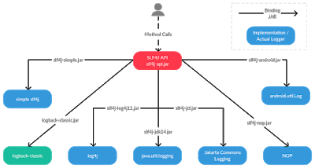
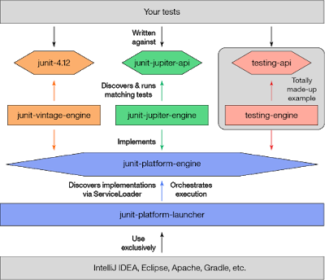
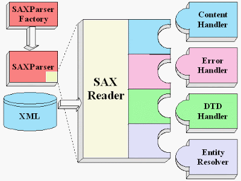
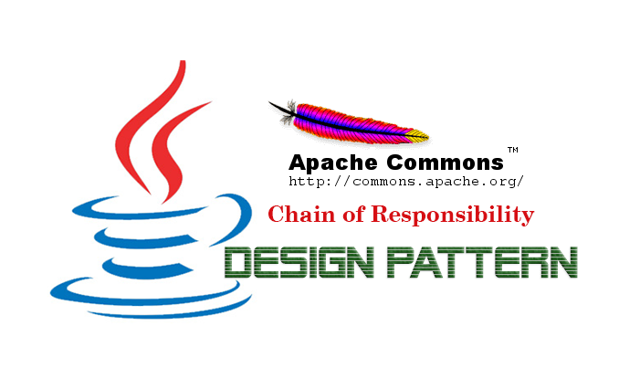
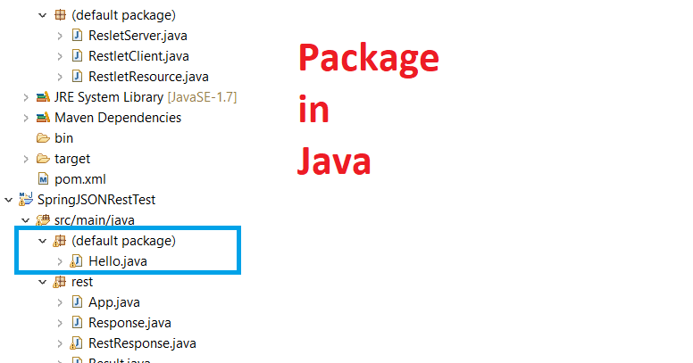
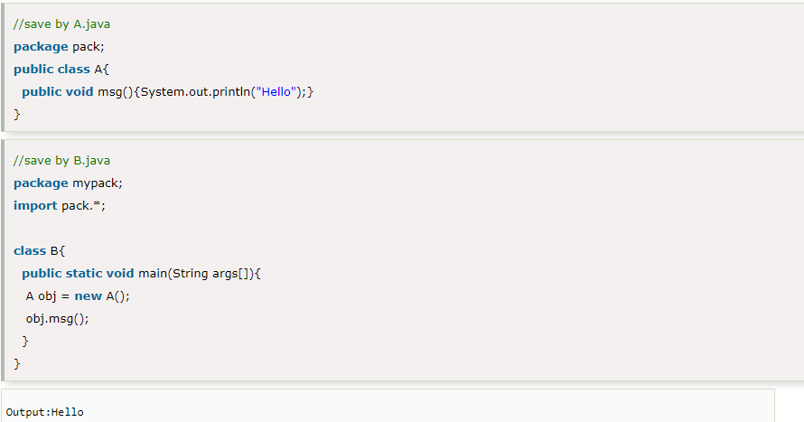
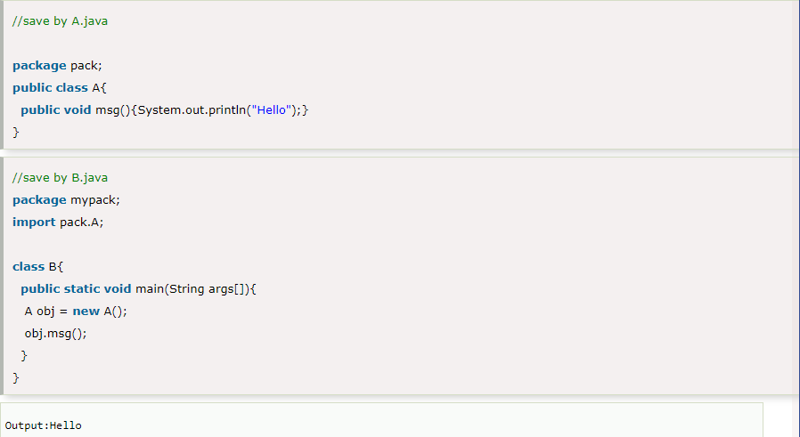
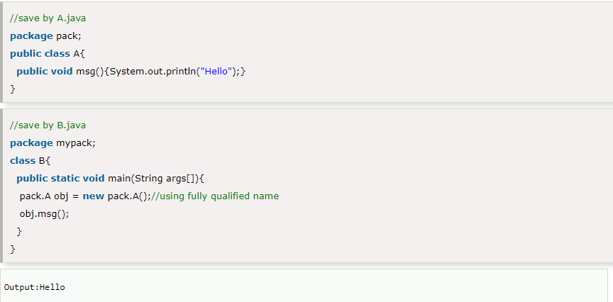

**Trong ngôn ngữ lập trình Java có thể nói thư viện và package là một trong những thứ mà dân lập trình cần phải có hiểu biết và biết cách sử dụng. Vậy thư viện và package trong java là gì ?**

## Thư viện trong Java là gì?

Thư viện trong Java chỉ là một tập hợp các lớp đã được viết bởi người khác có thể tải động mà các ngôn ngữ Máy ảo Java (JVM) có thể gọi vào lúc chạy.

Bạn tải xuống các lớp đó và cho máy tính của bạn biết về chúng, sau đó bạn có thể sử dụng các lớp đó trong mã của mình.

Điều này cho phép bạn mở rộng những gì Java có thể làm và dựa vào mã mà người khác đã thử nghiệm thay vì tự mình làm mọi thứ.

## Những thư viện trong Java mà bạn nên biết
### Logging Libraries (Thư viện ghi nhật ký)

Thư viện ghi nhật ký rất phổ biến, vì bạn cần chúng trong mọi dự án. Chúng là thứ quan trọng nhất đối với các ứng dụng phía máy chủ, vì nhật ký chỉ được đặt ở nơi bạn có thể thấy những gì đang diễn ra trên ứng dụng của mình.

Mặc dù JDK có thư viện ghi nhật ký của riêng nó, nhưng vẫn có những lựa chọn thay thế tốt hơn, ví dụ như Log4j, SLF4j và LogBack.

### Unit Testing Libraries (Thư viện kiểm tra đơn vị)

Kiểm thử đơn vị Java cung cấp cho các lập trình viên một phương tiện chuẩn hóa, tinh vi và có thể mở rộng để xây dựng một ứng dụng web hoặc bất kỳ phần mềm nào khác. Nó bao gồm một bộ sưu tập lớn các gói cung cấp mã được viết sẵn. Tùy thuộc vào lựa chọn của bạn về các khung thử nghiệm cho Java, chúng kết hợp các thư viện, trình biên dịch, công cụ và API.

### XML Parsing Libraries (Thư viện phân tích cú pháp XML)

Có nhiều thư viện phân tích cú pháp XML, bao gồm Xerces, JAXB, JAXP, Dom4j và Xstream. Xerces2 là thế hệ tiếp theo của trình phân tích cú pháp XML hoàn toàn tuân thủ, hiệu suất cao trong họ Apache Xerces. Phiên bản mới này của Xerces giới thiệu Xerces Native Interface (XNI), một khung hoàn chỉnh để xây dựng các cấu hình và thành phần phân tích cú pháp cực kỳ mô-đun và dễ lập trình.

### Apache Commons (Thư viện mục đích chung)

Commons Math: Thư viện Toán học Apache Commons - cái tên nói lên tất cả: thư viện này chứa các thành phần cho phép các phép toán và tính toán cao cấp, thống kê.

Commons CLI - cung cấp API để phân tích cú pháp các đối số dòng lệnh. Tại sao bạn thậm chí sẽ bận tâm tạo một ứng dụng mà không có khả năng chuyển các tham số và kiểm soát hành vi của nó.

Commons IO - nó đang được sử dụng để thực hiện các thao tác nhập / xuất dễ dàng hơn. Kiểm tra ít nhất là ReversedLinesFileReader chắc chắn đáng giá.

### Java Standard libraries (Các thư viện chuẩn Java)

**java.lang** luôn được nhập ngầm vì nó chứa mọi thứ mà bạn về cơ bản không thể lập trình nếu không có String, Double, Enum, Math, v.v.

Trong **java.util**, bạn có thể tìm thấy tất cả các bộ sưu tập và cấu trúc dữ liệu có sẵn trong Java.

Tiếp theo có **java.io** để đọc tệp, làm việc với đường dẫn, luồng và tương tự.

Ngoài ra còn có **java.nio** , thực sự là sự thay thế cho **java.io** và là viết tắt của I / O không chặn. Nó cho phép sử dụng chuyên sâu các hoạt động đầu vào / đầu ra như bạn có thể đoán.

**java.math** cung cấp chức năng để làm việc với các giá trị thập phân ( `BigDecimal` ) và số nguyên ( `BigInteger` ) có độ chính xác tùy ý.

**java.net** đang được sử dụng để làm việc với socket, tạo kết nối hay nói ngắn gọn là tạo các ứng dụng mạng.

Trong Java,  cũng có các thư viện để làm việc với GUI: `javax.swing`(phần mở rộng của cũ hơn `java.awt`).

Ngoài ra còn có một số thư viện khác như Date and Time Libraries, Collection Libraries, Email APIs, HTTP Libraries, Excel Reading Libraries......v.v

## Package trong Java là gì?

Packge (gói) trong java là một nhóm các loại lớp, giao diện và gói con tương tự nhau.

Gói trong java có thể được phân loại theo hai dạng, gói có sẵn và gói do người dùng định nghĩa.

Có nhiều gói tích hợp sẵn như java, lang, awt, javax, swing, net, io, Prac, sql, v.v.

## Những điều bạn cần biết về Package?

Quy ước đặt tên Package (gói):Các gói được đặt tên theo thứ tự ngược lại của tên miền, tức là org.geeksforgeeks.practice. Ví dụ: trong trường cao đẳng, quy ước được đề xuất là college.tech.cse, college.tech.ee, college.art.history, v.v.

Thêm một lớp vào một Gói: Chúng ta có thể thêm nhiều lớp hơn vào một gói đã tạo bằng cách sử dụng tên gói ở đầu chương trình và lưu nó trong thư mục gói. Chúng ta cần một tệp java mới để xác định một lớp công khai, nếu không chúng ta có thể thêm lớp mới vào tệp .java hiện có và biên dịch lại nó.

Các gói con : Các gói bên trong một gói khác là các gói con . Chúng không được nhập theo mặc định, chúng phải được nhập rõ ràng. Ngoài ra, các thành viên của một gói con không có đặc quyền truy cập, tức là, chúng được coi là gói khác nhau đối với các chỉ định truy cập mặc định và được bảo vệ.

Dựa trên việc gói package được xác định bởi người dùng hay không, các gói package được chia thành hai loại:
- Gói package được xây dựng sẵn (buit-in)
- Gói package do người dùng xác định (defined)

## Làm thế nào để truy cập gói từ gói khác?

Có ba cách để truy cập gói từ bên ngoài gói: 

import package.*;Từ khóa import được sử dụng để làm cho các lớp và giao diện của một gói khác có thể truy cập được vào gói hiện tại.

import package.classname;

fully qualified name.

## Kết Luận

Có thể nói Thư viện và package trong Java đóng vai trò rất quan trọng đối với lập trình viên. Khi lập trình viên biết tận dụng những điều đó sẽ làm cho việc code của mình trở nên dễ dàng và thuận lợi hơn.